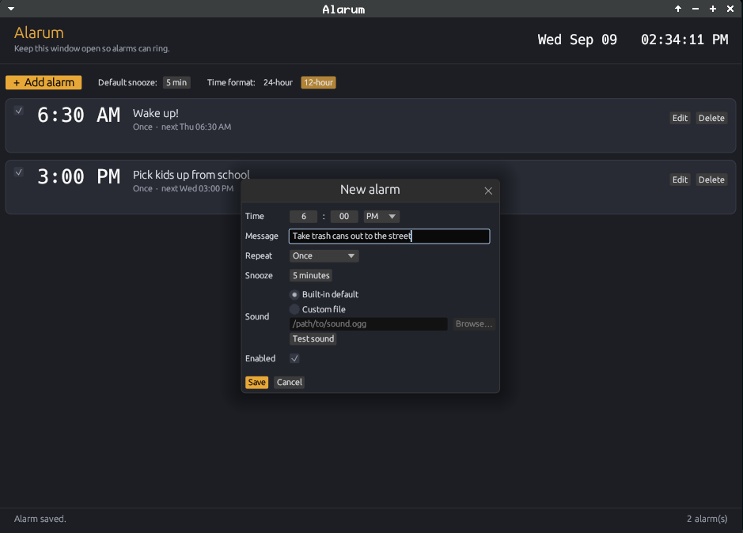

# Alarum

**A small desktop alarm clock written in Rust with [egui](https://github.com/emilk/egui).**

*It is meant to run on Fedora (including XFCE) and other Linux desktops.*

[](https://crates.io/crates/alarum)
[](./LICENSE)
[](https://www.rust-lang.org)

---



## Features

- Plays a sound when an alarm goes off (loops until you dismiss or snooze)
- Built-in default two-tone chime, or pick your own audio file
- Multiple alarms
- Custom message shown when the alarm rings (for example, “Pick up kids from school”)
- Snooze, with a per-alarm duration
- One-shot, daily, weekday, or weekend repeat
- Desktop notification via `notify-send` when available
- Alarms saved to `~/.config/alarum/alarms.json`
- 12-hour / 24-hour toggle (saved with your alarms)

The app checks the clock only while it is running. Leave the window open (it can stay in the background).

---

## Installation

### Cargo:

```bash
cargo install alarum
```

Then:

```bash
alarum
```

### Build on Fedora

Clone this repo, then:

```bash
sudo dnf install rust cargo gcc
# optional, for a nicer file picker and notifications
sudo dnf install zenity libnotify
# optional players — Alarum will use the first one it finds
sudo dnf install mpv pipewire-utils pulseaudio-utils
```

Then:

```bash
cd alarum
cargo run --release
```

The binary will be at `target/release/alarum`.

---

## Usage

1. Click **Add alarm**.
2. Set the time and a message.
3. Leave **Built-in default** selected, or choose **Custom file** and browse to a `.wav`, `.ogg`, `.oga`, `.mp3`, or similar.
4. Click **Test sound** if you want to hear it first.
5. Save, and keep Alarum running.

When an alarm fires, the window comes forward with your message plus **Snooze** and **Dismiss**. A one-shot alarm turns itself off after dismiss; repeating alarms stay enabled.

---

## Why egui?

egui/eframe keeps the app desktop-agnostic. It does not pull in the GNOME or KDE stacks, which matters on XFCE. Audio is played with whatever is already on the system (`mpv`, `pw-play`, `paplay`, `ffplay`, or `aplay`) instead of embedding an audio engine.

---

## License

Licensed under the [MIT License](./LICENSE).

---

## Contributing

Pull requests are welcome.
Feel free to fork, tinker, and open an issue or PR if you have improvements.
